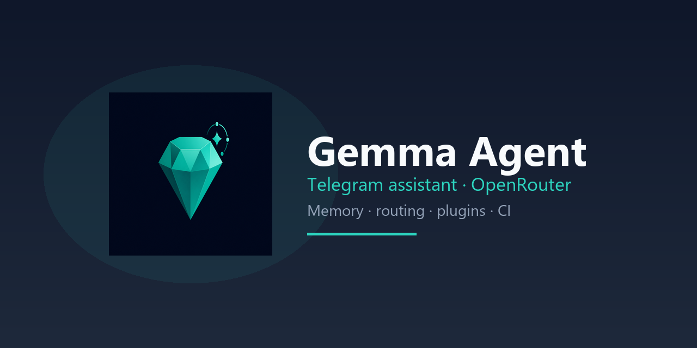

<p align="center">
  
</p>

<!-- AGENT-ONLY: Context: CHATGPT_PASTE.md or AGENTS.md. Cursor: .cursor/README.md -->

# Gemma Agent

**Telegram assistant for a small trusted circle (3–8 users)** — memory, routing, tools when needed.

Uses **[OpenRouter](https://openrouter.ai/)** (you choose the model). This repository is the **orchestrator** around that API — routing, memory, guards, deployment.

| Often assumed | What we built |
|---------------|---------------|
| On-device LLM only | Cloud models via **OpenRouter** (GPT, Claude, Gemini, …) |
| LangChain-style agent framework | **Telegram product** with plugins and ops tooling |
| Demo without tests | **2779+** pytest cases, CI on every PR — see [CI.md](docs/CI.md) |

**In one line:** a production-minded **Telegram assistant** (default) with an optional power-agent mode.

**Default behavior:** message → route → LLM → reply (assistant). Multi-step agent loops are **opt-in** — [docs/HONEST_POSITIONING.md](docs/HONEST_POSITIONING.md).

<p align="center">
  <a href="https://github.com/ManSio/gemma_agent/actions/workflows/ci.yml"></a>
  <a href="docs/CI.md"></a>
  <a href="LICENSE"></a>
  <a href="VERSION"></a>
</p>

<p align="center">
  <a href="docs/index.md"></a>
  <a href="https://github.com/ManSio/gemma_agent"></a>
  <a href="README.ru.md"></a>
</p>

---

## Start here

| You are… | Read first |
|----------|------------|
| **New visitor** | [docs/REPO_MAP.md](docs/REPO_MAP.md) |
| **Honest limits & positioning** | [docs/HONEST_POSITIONING.md](docs/HONEST_POSITIONING.md) |
| **Want to run the bot** | [docs/getting-started/quickstart.md](docs/getting-started/quickstart.md) |
| **Want proof of tests & CI** | [docs/CI.md](docs/CI.md) → [docs/ACCEPTANCE_CRITERIA.md](docs/ACCEPTANCE_CRITERIA.md) |
| **Want prod metrics (tokens, $, latency)** | [docs/PRODUCTION_EVIDENCE_REPORT.md](docs/PRODUCTION_EVIDENCE_REPORT.md) |
| **Want architecture** | [docs/ARCHITECTURE.md](docs/ARCHITECTURE.md) |
| **Cursor agent** | [`.cursor/README.md`](.cursor/README.md) |

```bash
python scripts/print_repo_stats.py          # verify test count & CI files
python -m pytest tests/ --collect-only -q   # 2779+ collected
```

---

## At a glance

| | |
|---|---|
| **Users** | 3–8 trusted people with admin approval |
| **Tests** | **440+** files · **2779+** cases — [`tests/`](tests/) · [`pytest.ini`](pytest.ini) |
| **CI** | [`.github/workflows/ci.yml`](.github/workflows/ci.yml) — every push/PR: ruff + smoke + full pytest + privacy |
| **Modules** | 19 plugins (public build) |
| **Deploy** | Native systemd, Docker Compose, or panel scripts |
| **Hardware** | From **1 GB + VPN** to 4 GB VPS — [system requirements](docs/SYSTEM_REQUIREMENTS.md) |

---

## Honest positioning (if README feels “too much”)

**Timeline:** production bot since **2026-05-02**; public GitHub export **2026-06-06** — not a “one-day” repo. Low stars match **private-first** scope, not PoC-only quality.

| Question | Short answer |
|----------|--------------|
| Over-engineering? | **Default path is simple assistant.** Healers / goal runner / verify loops are **opt-in** ([AGENT_LOOP.md](docs/AGENT_LOOP.md)). |
| STM / MTM / LTM? | Labels for **three storage layers** — `behavior_store`, compactor, Mem0 ([MEMORY.md](docs/MEMORY.md)). |
| Self-healing? | Event bus healers + safe mode — **not** only `try/except` ([SELF_HEALING.md](docs/SELF_HEALING.md), `core/event_healers.py`). |
| Agent vs assistant? | **Assistant by default.** Plan→tool→verify needs `GOAL_RUNNER_ENABLED=true` ([HONEST_POSITIONING.md](docs/HONEST_POSITIONING.md)). |
| Strongest asset? | **Engineering discipline** — 2779+ tests, CI, acceptance gates (verifiable below). |
| MetaGPT / OpenHands tier? | **No** — default **6/10**, power mode **7.5/10** agent-ness ([HONEST_POSITIONING.md](docs/HONEST_POSITIONING.md)). |

---

## Capabilities

| Capability | Default | Notes |
|------------|:-------:|-------|
| Chat, routing, skills | **yes** | Hot path every message |
| Weather, web search, news | **yes** | Open-Meteo + SearXNG |
| Reminders & schedule | **yes** | |
| Long-term memory | **yes** | Mem0 stub or server |
| Image / vision | opt-in | env flags |
| Voice STT/TTS | opt-in | Piper/Vosk |
| Goal runner (multi-step agent) | **off** | `GOAL_RUNNER_ENABLED=false` — enable via `power_agent` profile |
| Self-verify / quality loop | **off** | opt-in critic loops |
| Self-healing / safe mode | partial | healers env-gated; LLM retry always on |
| Learning from 👎 | opt-in | ephemeral autolearn |
| MCE / mesh / spatial | no | stripped in public build |

---

## Quick install (native)

```bash
git clone https://github.com/ManSio/gemma_agent.git /opt/gemma_agent
cd /opt/gemma_agent
bash scripts/agent_bootstrap.sh
# edit .env — TELEGRAM_TOKEN, OPENROUTER_API_KEY, ADMIN_USER_IDS
bash scripts/gemma_panel.sh start-all
python scripts/gemma_status.py --online
```

**Full guide:** [docs/getting-started/quickstart.md](docs/getting-started/quickstart.md)

---

## Docker

```bash
cp .env.example .env   # fill secrets
docker compose build
docker compose up -d app
```

Native deploy recommended on small VPS (1 GB + VPN — verified). Docker: see [DEPLOY.md](docs/DEPLOY.md).

SearXNG in Docker (optional): `cd infra/searxng && docker compose up -d`  
**Deploy guide:** [docs/DEPLOY.md](docs/DEPLOY.md) · **Backups:** `bash scripts/backup.sh`

---

## Tests & CI

**GitHub Actions** runs the same gates on every PR — see [docs/CI.md](docs/CI.md).

```bash
pip install -r requirements-dev.txt
python scripts/print_repo_stats.py            # test file count, workflows
python -m pytest tests/ -q                    # full suite (2779+)
python scripts/release_guard.py --smoke       # = CI smoke job (~1 min)
python scripts/release_guard.py               # smoke + 90 anti-regression tests
```

Config: [`pytest.ini`](pytest.ini) · [CI.md](docs/CI.md) · [testing.md](docs/developer-guide/testing.md)

---

## Key documentation

| Topic | Link |
|-------|------|
| **Honest positioning (hub)** | [docs/HONEST_POSITIONING.md](docs/HONEST_POSITIONING.md) |
| **Cursor agent** | [.cursor/README.md](.cursor/README.md) |
| **Repo map (first visit)** | [docs/REPO_MAP.md](docs/REPO_MAP.md) |
| **CI & tests proof** | [docs/CI.md](docs/CI.md) |
| Agent loop (Plan→Verify) | [docs/AGENT_LOOP.md](docs/AGENT_LOOP.md) |
| Architecture (Mermaid) | [docs/ARCHITECTURE.md](docs/ARCHITECTURE.md) |
| Memory STM/MTM/LTM | [docs/MEMORY.md](docs/MEMORY.md) |
| Self-healing | [docs/SELF_HEALING.md](docs/SELF_HEALING.md) |
| Acceptance criteria | [docs/ACCEPTANCE_CRITERIA.md](docs/ACCEPTANCE_CRITERIA.md) |
| System requirements | [docs/SYSTEM_REQUIREMENTS.md](docs/SYSTEM_REQUIREMENTS.md) |
| Deployment & backups | [docs/DEPLOY.md](docs/DEPLOY.md) |
| Security (honest) | [docs/security/security-model.md](docs/security/security-model.md) |
| All docs | [docs/index.md](docs/index.md) |
| LLM index | [llms.txt](llms.txt) · [docs/llms.txt](docs/llms.txt) |

---

## Resources

| | |
|---|---|
| [Contributing](CONTRIBUTING.md) | Dev setup, PR process |
| [Security policy](SECURITY.md) | Report vulnerabilities |
| [MIT License](LICENSE) | |
| [Code of Conduct](CODE_OF_CONDUCT.md) | |

---

## Verify before release

```bash
python scripts/release_guard.py
python scripts/check_public_privacy.py --ci
python scripts/agent_security_audit.py
```

