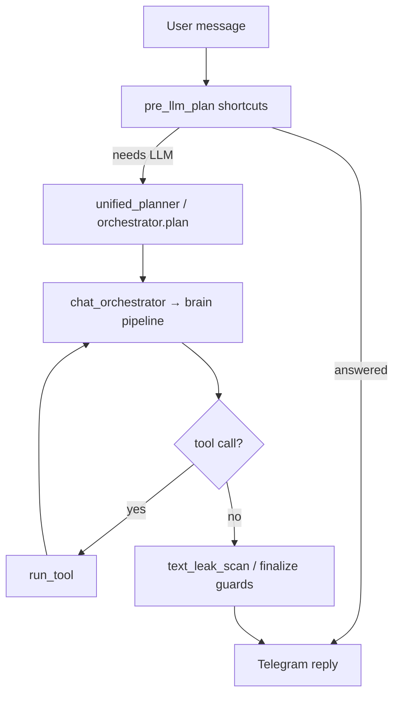
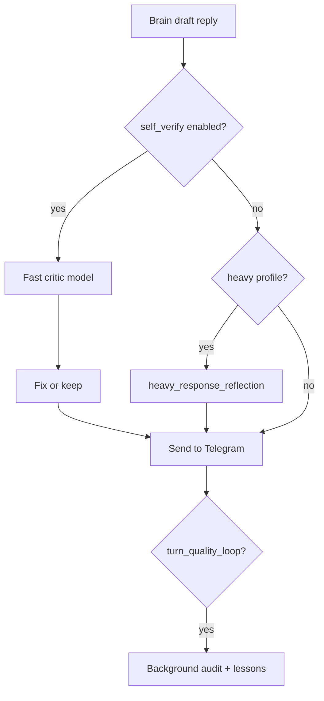

# Agent loop — Plan → Execute → Verify

Honest answer to *"is this just LLM → tool → LLM?"*

**Short answer:** Default public config is **chat-first** (routing + tools). Full multi-step agent loops **exist in code** but several are **opt-in** — critics who only read `orchestrator.py` miss them.

**Not claimed:** Claude Code replacement, autonomous coding agent, local tiny-Gemma stack.  
**Actual stack:** Telegram + **OpenRouter** (you choose the model) + plugins.

---

## Default path (most Telegram messages)



This is intentionally **stable and fast** for 3–8 users — not maximal autonomy on every turn.

---

## Multi-step agent loop (Goal Runner — opt-in)

| Env | Default (public) | Role |
|-----|:----------------:|------|
| `GOAL_RUNNER_ENABLED` | `false` | Multi-step plan → tool steps → answer |
| `GOAL_RUNNER_PLAN_VALIDATOR` | `true` | Structural plan validation before execute |
| `GOAL_RUNNER_EXECUTOR_MODE` | varies | One-toggle executor profile |


Code: `core/goal_runner.py`, `core/goal_plan_validate.py`  
Tests: `tests/test_goal_runner.py`, `tests/test_goal_plan_validate.py`

**Fair criticism:** with `GOAL_RUNNER_ENABLED=false`, most users see routing + single-turn brain — not full autonomous task execution.

---

## Verify / Critic loops (exist, mostly opt-in)

| Component | Default | What it does |
|-----------|:-------:|--------------|
| `self_verify_pass` | `SELF_VERIFY_ACTIVE=false` | Fast model checks reply before send |
| `heavy_response_reflection` | on for heavy profiles | Second pass on long/summarization turns |
| `turn_quality_loop` | `TURN_QUALITY_LOOP_ENABLED=false` | Post-hoc route/contract audit per turn |
| `acc11_honest_refusal` | on | Refuse when sources missing |
| `brain_glitch_fallback` | on | Recover empty/garbage model output |



Tests: `test_brain_self_verify_pass.py`, `test_heavy_response_reflection.py`, `test_turn_quality_loop.py`, `test_acc11_honest_refusal.py`

**Fair criticism:** without enabling self-verify + quality loop, there is no always-on Plan→Execute→**Verify** cycle on every message. Verification is **selective** (guards + heavy-path reflection).

---

## Recovery after errors (on by default)

| Layer | File | Behavior |
|-------|------|----------|
| LLM retry | `llm_transient_recovery.py` | Timeout / 5xx fallback |
| Safe mode | `resilience_controller.py` | Degrade to allowlist modules |
| Healers | `event_healers.py` | Auto-disable failing modules |
| Rollback | `auto_rollback.py` | Passport / config rollback |

See [SELF_HEALING.md](SELF_HEALING.md).

---

## Memory (not “last N messages only”)

| Tier | Store | Semantic? |
|------|-------|:---------:|
| STM | `behavior_store` | dialogue compression |
| MTM | `dialogue_compactor`, `user_facts` | working context |
| LTM | Mem0 API / stub, `episodic_memory`, Qdrant RAG (books) | stub: **no**; server: **yes** |

See [MEMORY.md](MEMORY.md).

**Fair criticism:** default Mem0 **stub** is JSON + substring search — not enterprise semantic memory. Use Mem0 server or Qdrant path for retrieval quality.

---

## Security (tools, not open shell)

| Control | Status |
|---------|--------|
| `dangerous_command_guard.py` | Detects shell injection patterns; modes `log` / `block` |
| `SecurityManager` | Flood, suspicious links, file intake |
| Admin-only ops | `ADMIN_USER_IDS` gate |
| No arbitrary `rm -rf` tool in public catalog | SelfDeployment limited; no Claude-Code-style shell agent |

Tests: `tests/test_security_layer.py`, plugin contract tests.

**Fair criticism:** no full OS sandbox (gVisor/firecracker). Trust model = small trusted circle.

---

## Positioning vs coding agents

| | Gemma Agent (public) | Claude Code / OpenHands |
|--|---------------------|-------------------------|
| Primary UI | Telegram | IDE / terminal |
| Model | OpenRouter (your choice) | Hosted frontier |
| Coding loop | document intake, RAG, admin tools | edit_file, test, iterate |
| Target users | 3–8 trusted people | professional dev teams |
| Complex long tasks | 4–5/10 honest | 7–8/10 |

**Educational value:** high (8/10) — readable plugin architecture, real test suite.  
**Replace coding agents:** not the goal (2–3/10).

---

## Enable “fuller agent” — `power_agent` profile

One command applies all opt-in flags to your working `.env`:

```bash
cp .env.example .env   # if needed
python scripts/apply_power_agent_env.py
# or: bash scripts/apply_power_agent_env.sh
```

Reference fragment (all keys + comments): [`config/power_agent.env.fragment`](../config/power_agent.env.fragment)

| Flag | Value | Effect |
|------|:-----:|--------|
| `GOAL_RUNNER_ENABLED` | true | Multi-step plan → tools → answer |
| `SELF_VERIFY_ACTIVE` | true | Fast critic before send |
| `TURN_QUALITY_LOOP_ENABLED` | true | Background turn audit |
| `HEALERS_ENABLED` | true | Module failure healers |
| `MCE_*` | false | Stays off in public build |

**Semantic memory:** in `scripts/gemma_panel.local.conf` set `GEMMA_MEM0_USE_STUB=false` and run Mem0 server (`apply_mem0_local_server.sh` or your URL).

Then verify:

```bash
pytest tests/test_goal_runner.py tests/test_turn_quality_loop.py tests/test_apply_power_agent_env.py -q
python scripts/gemma_status.py --online
bash scripts/gemma_panel.sh restart-all
```
