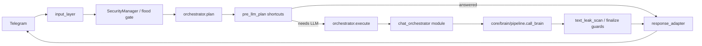
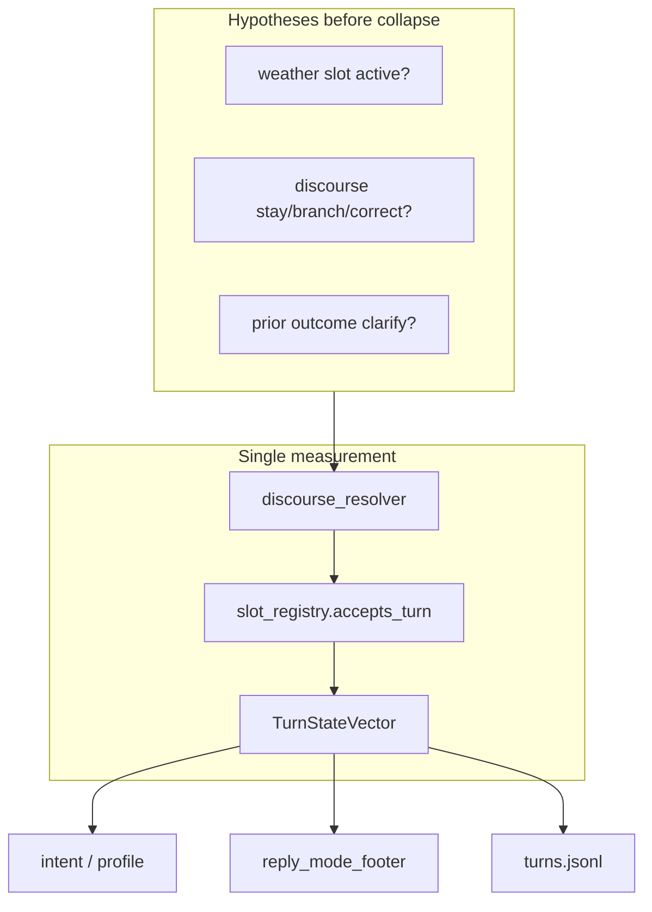

# Architecture

Gemma Agent is a **personal agent platform** (Telegram) with **two modes:**

| Mode | Default | Path |
|------|:-------:|------|
| **Assistant** | **yes** | route → LLM → tools → reply |
| **Power Agent** | no | goal runner + verify + quality loop |

Public build: **19 plugins**, **2779+** pytest cases (440+ files). Intelligence via **OpenRouter** — this repo is the **orchestrator**.

**Scope:** 3–8 trusted users. Not multi-tenant SaaS. Not MetaGPT / OpenHands.

Honest positioning: [HONEST_POSITIONING.md](HONEST_POSITIONING.md)

---

## Message path (one turn)

Most chat goes: **input → orchestrator → chat_orchestrator → OpenRouter → guards → Telegram**.

### Turn state collapse (v3.5.11+)

Before routing/brain/footer, each user message is collapsed into one **TurnStateVector** (`core/turn_state.py`):

Entry point: `core/turn_reconcile.py` (orchestrator `plan()`, `pipeline.call_brain`, `resolve_brain_route`).  
Slot contracts: `core/slot_registry.py` (like `profile_registry` for brain profiles).

---

## Layers

| Layer | Path | Responsibility |
|-------|------|----------------|
| Entry | `main.py`, `api.py` | Boot, plugin load, polling/webhook |
| Ingress | `core/input_layer.py` | Dedup, locks, Telegram parsing |
| Planning | `core/orchestrator.py`, `core/pre_llm_plan.py` | Route without LLM when possible |
| Brain | `core/brain/pipeline.py` | Single LLM turn, tools, context budget |
| Plugins | `modules/*/module.json` | Weather, search, memory, voice, … |
| Resilience | `core/resilience_controller.py`, `core/event_healers.py` | Safe mode, healers, rollback |
| State | `data/` (gitignored) | Behavior, runtime, Mem0 stub |

---

## Plugin model

Each module exposes `module.json` + `module.py`. Catalog: `config/modules_catalog.json` (tier A/B).

| Contract | Type |
|----------|------|
| Input | `core.models.Input` |
| Plan | `core.models.Plan` |
| Output | `core.models.Output` |

Validate: `pytest tests/test_plugin_contract.py -q`

---

## Context management (not “full history every step”)

| Component | Role |
|-----------|------|
| `core/behavior_store.py` | Dialogue STM with compression |
| `core/context_compression.py` | Trim paired messages |
| `core/dialogue_compactor.py` | LLM summary of overflow |
| `core/brain/context_budget.py` | UX warn before token overflow (no auto-truncate) |
| `core/context_collapse.py` | Optional collapse + `enforce_context_limit()` hard prune |
| `core/compactor.py` | LLM summary when over budget threshold |
| `core/brain/brief_context_filter.py` | Slim prompt assembly |

Tests: `test_context_compression.py`, `test_compactor.py`, `test_context_hard_limit.py`, `test_brain_chat_context_slim.py`

Runbook: `docs/CONTEXT_BUDGET_GUIDE_RU.md`

---

## External dependencies

| Service | Required | Fallback |
|---------|:--------:|----------|
| OpenRouter | yes | `llm_transient_recovery`, tier downgrade |
| SearXNG | recommended | Honest “search unavailable” + connectivity check |
| Mem0 | recommended | Local JSON stub or server |

---

## Diagram (static)

## Orchestrator scale (tech debt honesty)

| Fact | Note |
|------|------|
| `core/orchestrator.py` | ~4400 lines — long-lived monolith |
| `.env.example` | ~990 keys — family-lab heritage; prod uses subset |
| Mitigation | Plugins decouple features; default path stays narrow; routing tests |

We do not claim microservice elegance. Claim: **tested plugin-bound monolith**.

---

**Deeper dive:** [developer-guide/architecture.md](developer-guide/architecture.md)
