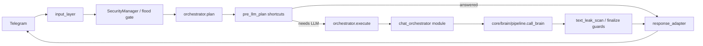

# Architecture

Gemma Agent is a **plugin-based Telegram assistant** — not a single `orchestrator.py` script. The public build ships **19 modules**, **2573+ pytest cases** (407 files), and layered resilience.

**Scope:** 3–8 trusted users with admin approval. Not multi-tenant SaaS.

---

## Message path (one turn)

Most chat goes: **input → orchestrator → chat_orchestrator → OpenRouter → guards → Telegram**.

---

## Layers

| Layer | Path | Responsibility |
|-------|------|----------------|
| Entry | `main.py`, `api.py` | Boot, plugin load, polling/webhook |
| Ingress | `core/input_layer.py` | Dedup, locks, Telegram parsing |
| Planning | `core/orchestrator.py`, `core/pre_llm_plan.py` | Route without LLM when possible |
| Brain | `core/brain/pipeline.py` | Single LLM turn, tools, context budget |
| Plugins | `modules/*/module.json` | Weather, search, memory, voice, … |
| Resilience | `core/resilience_controller.py`, `core/event_healers.py` | Safe mode, healers, rollback |
| State | `data/` (gitignored) | Behavior, runtime, Mem0 stub |

---

## Plugin model

Each module exposes `module.json` + `module.py`. Catalog: `config/modules_catalog.json` (tier A/B).

| Contract | Type |
|----------|------|
| Input | `core.models.Input` |
| Plan | `core.models.Plan` |
| Output | `core.models.Output` |

Validate: `pytest tests/test_plugin_contract.py -q`

---

## Context management (not “full history every step”)

| Component | Role |
|-----------|------|
| `core/behavior_store.py` | Dialogue STM with compression |
| `core/context_compression.py` | Trim paired messages |
| `core/dialogue_compactor.py` | LLM summary of overflow |
| `core/brain/context_budget.py` | Warn before token overflow |
| `core/brain/brief_context_filter.py` | Slim prompt assembly |

Tests: `test_context_compression.py`, `test_compactor.py`, `test_brain_chat_context_slim.py`

---

## External dependencies

| Service | Required | Fallback |
|---------|:--------:|----------|
| OpenRouter | yes | `llm_transient_recovery`, tier downgrade |
| SearXNG | recommended | Honest “search unavailable” + connectivity check |
| Mem0 | recommended | Local JSON stub or server |

---

## Diagram (static)

**Deeper dive:** [developer-guide/architecture.md](developer-guide/architecture.md)
