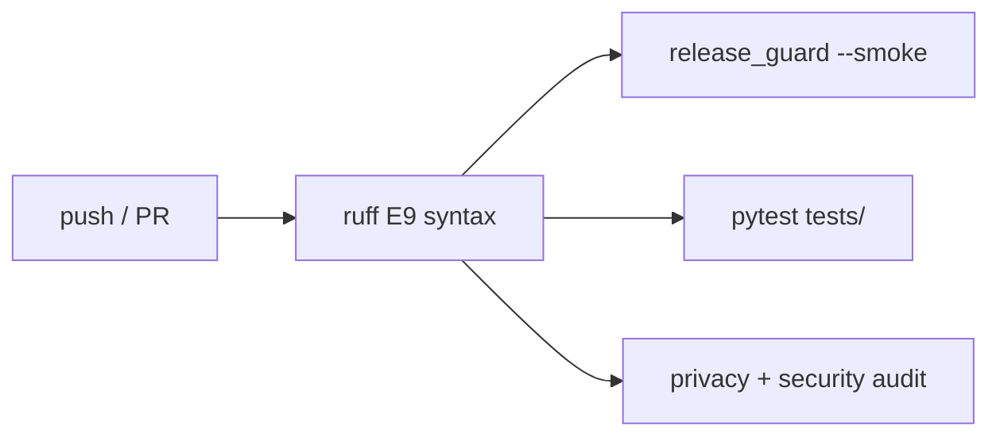

# Continuous Integration (CI)

Every push and pull request runs automated checks. **Do not assume tests are missing — open Actions tab or run commands below.**

---

## Workflows (`.github/workflows/`)

| Workflow | File | Trigger | What runs |
|----------|------|---------|-----------|
| **CI** | [`ci.yml`](../.github/workflows/ci.yml) | push/PR → `main`, `master` | ruff syntax → smoke → full pytest → privacy + security |
| **Release guard** | [`release-guard.yml`](../.github/workflows/release-guard.yml) | push/PR | privacy scan → `release_guard.py` → full pytest |
| **Mutation L2** | [`mutation-l2.yml`](../.github/workflows/mutation-l2.yml) | manual / schedule | Optional mutation tests on pure guards |
| **Dependabot** | [`dependabot.yml`](../.github/dependabot.yml) | weekly | Dependency update PRs |

**Primary gate for contributors:** `ci.yml` (visible badge in README).

---

## CI job breakdown (`ci.yml`)



| Job | Duration | Pass means |
|-----|----------|------------|
| `lint` | ~30s | No Python syntax errors |
| `test` / smoke | ~1–2 min | Plugin contracts, compile, docs lint |
| `test` / full | ~10–20 min | **All collected pytest tests green** |
| `privacy` | ~1 min | `pip-audit` clean + no secrets + security checklist |

Environment: **Ubuntu**, **Python 3.12**, `PYTHONPATH=.`

---

## Test inventory (verify locally)

```bash
python scripts/print_repo_stats.py
python -m pytest tests/ --collect-only -q   # exact count
find tests -name 'test_*.py' | wc -l          # file count
```

| Metric | Typical value |
|--------|---------------|
| Test files | **407** (`tests/test_*.py`) |
| Collected cases | **2573+** |
| Anti-regression subset | **90** files in `release_guard.py` |
| Config | [`pytest.ini`](../pytest.ini), [`pyproject.toml`](../pyproject.toml) |

---

## Run the same checks locally (before PR)

```bash
pip install -r requirements.txt -r requirements-dev.txt

# Fast (~1 min) — same as CI smoke job
PYTHONPATH=. python scripts/release_guard.py --smoke

# Medium (~5–15 min) — smoke + anti-regression
PYTHONPATH=. python scripts/release_guard.py

# Full (~10–20 min) — entire suite
PYTHONPATH=. python -m pytest tests/ -q

# Dependency scan (CI privacy job)
bash scripts/pip_audit.sh

# Privacy + security (CI privacy job)
PYTHONPATH=. python scripts/check_public_privacy.py --ci
PYTHONPATH=. python scripts/agent_security_audit.py
```

---

## What CI does **not** test

- Live Telegram conversations (`gemma_status.py --online` — manual)
- Your host's SearXNG / Mem0 HTTP availability
- Prompt injection resistance (documented limitation)

See [ACCEPTANCE_CRITERIA.md](ACCEPTANCE_CRITERIA.md) and [security/security-model.md](security/security-model.md).

---

## Badge

README CI badge points to:  
`https://github.com/ManSio/gemma_agent/actions/workflows/ci.yml`  
Default branch: **`master`**.
