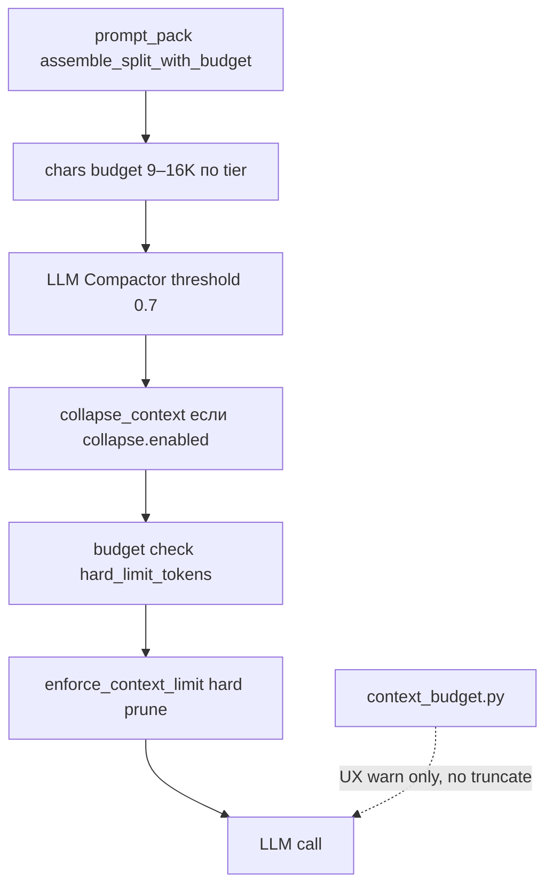

# CONTEXT_BUDGET — лимиты контекста и token efficiency

Runbook для оператора и coding-агента. Связано: `config/token_efficiency.yml`, `core/brain/pipeline.py`, `core/context_collapse.py`.

---

## Слои защиты (сверху вниз по hot path)



| Слой | Файл | Что делает |
|------|------|------------|
| Chars budget | `core/brain/prompt_pack.py` | `BRAIN_USER_PROMPT_BUDGET_CHARS*` — collapse_level 0..4 |
| Compactor | `core/compactor.py` | LLM-сжатие диалога/документов при давлении |
| Collapse | `core/context_collapse.py` | Summarize/truncate (только если `collapse.enabled: true`) |
| **Hard limit** | `core/context_collapse.py` → `enforce_context_limit()` | Режет `prompt_parts` по приоритету до `budget_hard_limit_tokens` |
| UX warn | `core/brain/context_budget.py` | Подсказка «/new» в ответе — **без** auto-truncate |

**Важно:** `context_budget.py` ≠ hard limit. Жёсткий потолок — `enforce_context_limit` + YAML `budget.hard_limit_tokens`.

---

## Конфиг (источник правды)

Файл: `config/token_efficiency.yml` (кеш ~30 с в `core/token_efficiency.py`).

| Ключ | Текущее (2026-06-13) | Назначение |
|------|----------------------|------------|
| `budget.enabled` | `true` | Включить проверку hard limit в pipeline |
| `budget.hard_limit_tokens` | **15000** | Потолок est. токенов на prompt_parts |
| `compactor.enabled` | `true` | LLM-compact диалога/документов |
| `compactor.threshold` | `0.7` | Срабатывание при 70% бюджета |
| `collapse.enabled` | `false` | Опционально: умное сжатие до hard prune |

Переопределение compactor budget: env `COMPACTOR_BUDGET_TOKENS` (default = `budget_hard_limit_tokens`).

**Не хардкодить** `15000` в `pipeline.py` — только через YAML / `budget_hard_limit_tokens()`.

---

## Приоритет prune (`enforce_context_limit`)

Режется **сначала** (низкий приоритет):

`message_archive` → `memory_facts` → `recent_dialogue` → `document_intake_block` → … → `user_facts`

**Никогда не режется:** `system_prompt_for_llm`, `user_text`, `agent_inst`.

---

## Мониторинг

### Метрики (MONITOR / admin)

| Метрика | Значение |
|---------|----------|
| `budget_exceeded_total` | Превышен hard limit (до/после collapse) |
| `context_hard_limit_enforced_total` | Сработал hard prune + reassemble |
| `context_hard_limit_pruned_total` | Вызов `enforce_context_limit` |
| `compactor_triggered_total` | LLM compactor отработал |

### Логи

```text
grep "context_limit" /var/log/gemma/*.log
grep "budget exceeded" /var/log/gemma/*.log
grep "prompt_metrics" /var/log/gemma/*.log
```

Поля telemetry: `budget_hard_limit`, `context_hard_limit`, `prompt_tokens_est`.

---

## Troubleshooting

| Симптом | Причина | Действие |
|---------|---------|----------|
| Высокий счёт OpenRouter input tokens | Старый деплой / collapse off + нет enforce | Pull `master`, проверить YAML, рестарт |
| Ответ «теряет» старый контекст | Hard prune или compactor | Ожидаемо при >15K; пользователю `/new` или короче вопрос |
| Частые UX «контекст большой» | `BRAIN_CONTEXT_BUDGET_WARN_CHARS=12000` (chars) | Поднять warn до 48000–60000 или снизить диалог |
| `compactor_enabled() == False` | Сломанный YAML (compactor внутри budget) | Исправить отступы в `token_efficiency.yml` |
| CI `ResolutionImpossible` aiohttp | `aiohttp>=3.14` vs aiogram | `aiohttp>=3.9.0,<3.14` в `requirements.txt` |

---

## Verify после изменений

```bash
python -m pytest tests/test_context_hard_limit.py tests/test_token_efficiency_config.py tests/test_compactor.py -q
python scripts/release_guard.py --smoke
python -c "from core.token_efficiency import budget_hard_limit_tokens, compactor_enabled; print(budget_hard_limit_tokens(), compactor_enabled())"
```

Ожидание: `15000 True`.

---

## Связанные документы

- `docs/DEV_DIARY_RU.md` — хронология и правила для агента
- `docs/ARCHITECTURE.md` — context management
- `docs/PRODUCTION_EVIDENCE_REPORT.md` — prod метрики токенов
- `docs/MEMORY.md` — STM/LTM → prompt_pack
