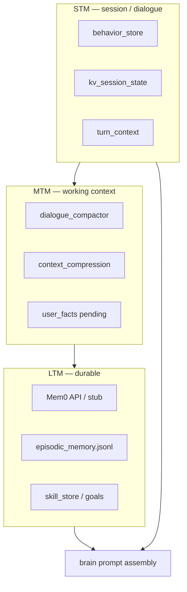

# Memory model (STM / MTM / LTM)

Gemma Agent uses **three memory tiers**. This is implemented in code — not marketing copy.

---

## Overview



---

## STM — Short-term (per chat)

| Store | Path | Purpose |
|-------|------|---------|
| Dialogue behavior | `data/behavior/<user>__dm.json` | Recent turns, topics, style |
| Session KV | `data/runtime/kv_session_state.json` | Sticky routing, pending flows |
| Turn context | in-memory per turn | Weather anchor, slot state |

- **Locking:** `behavior_store` uses `threading.Lock`
- **Compaction:** `trim_dialogue_messages_paired`, `compress_recent_dialogue`
- **Tests:** `test_behavior_dialogue_compact.py`, `test_session_trim.py`

---

## MTM — Medium-term (working memory)

| Component | Role |
|-----------|------|
| `dialogue_compactor` | Snippet → LLM summary when history overflows |
| `context_compression` | Budget-aware message trimming |
| `user_facts` | Confirmed facts queue before Mem0 write |
| `pre_llm_plan` | Recall without full LLM when possible |

**Not** “send entire chat every request” — brain applies slim context filters.

Tests: `test_compactor.py`, `test_memory_prompt_tiers.py`, `test_dialogue_slot_memory_hints.py`

---

## LTM — Long-term (durable)

| Backend | When | Storage |
|---------|------|---------|
| **Mem0 stub** (default dev) | Small circle, LAN | `data/mem0/*.json` |
| **Mem0 server** | Production | HTTP API (`MEM0_API_URL`) |
| **Episodic memory** | Autonomy events | `data/runtime/episodic_memory.jsonl` |
| **Skill store** | Learned skills | `data/skills/` with lock |

Slash commands: `/mem_list`, `/mem_search` — see `/help`.

**Honest limits (stub):** plain JSON, substring search, no multi-tenant isolation.  
Documented in [security/security-model.md](security/security-model.md).

Setup: [features/memory.md](features/memory.md)

---

## Brain integration

Module `memory` + `core/mem0_memory/` inject recall into `call_brain` when relevant — not a universal “dump all memories” payload.

```bash
pytest tests/test_memory_plugin_module.py tests/test_mem0_merge.py -q
```
