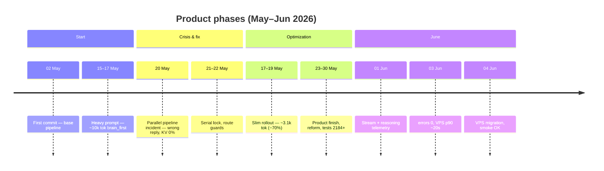
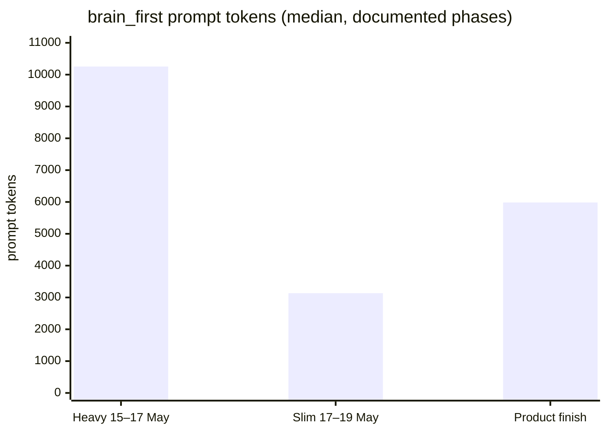
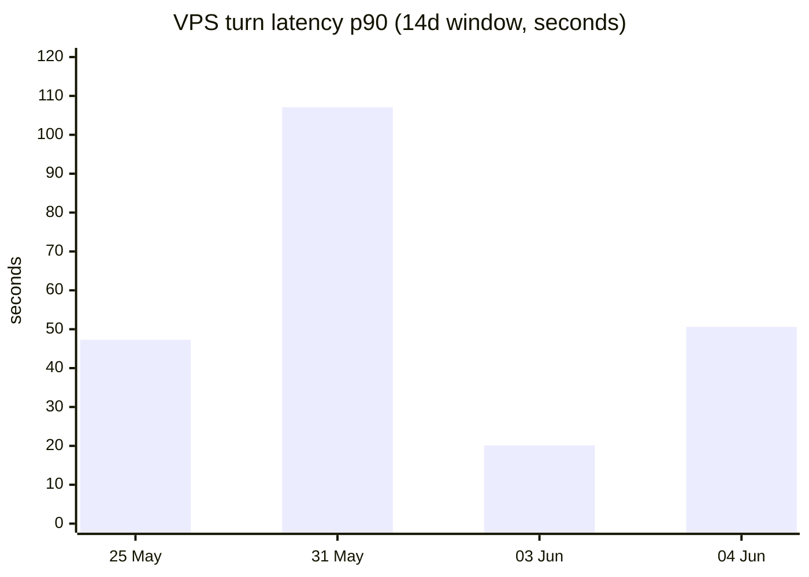

# Production evidence report — May–June 2026

> **Link-only readers:** ops metrics for a **Telegram + OpenRouter** bot (3–8 users) — not a compliance audit or generic agent-framework doc. Context: [CHATGPT_PASTE.md](../CHATGPT_PASTE.md)

**Period:** 2026-05-02 (first commit) → 2026-06-05  
**Snapshot date:** 2026-06-05  
**Audience:** reviewers who ask *“tests, costs, latency — real or README?”*

This is a **presentation-style summary** of measured production data from a private Telegram deployment (3–8 users). Numbers are **not invented** — they come from ops docs, `llm_usage.jsonl`, `turns.jsonl`, and scripts listed below. The public `gemma_agent` repo is an export of that codebase; this report explains what was measured on prod and what you can verify in git.

**Russian version:** [PRODUCTION_EVIDENCE_REPORT.ru.md](PRODUCTION_EVIDENCE_REPORT.ru.md)

---

## 0. Why this report exists

**Who it is for:** a Telegram assistant used by **3–8 trusted people** (family / close circle) — not a public SaaS, not an enterprise deployment.

**What we are trying to prove:**

| Yes | No |
|-----|-----|
| Tests and CI are real (verifiable in git) | “Smartest AI agent on GitHub” |
| Tokens, latency, and $ were **measured** on prod | Independent third-party audit |
| Problems were found and fixed (with dates) | Sub-second chat or zero bugs in Telegram |
| Method: **pain → metric → fix → new snapshot** | Marketing or a one-time vanity PDF |

**Who wrote it:** the owner/operator from production logs — a **reflection tool** published openly so reviewers do not have to trust README badges alone. Raw `turns.jsonl` / `llm_usage.jsonl` stay on the server (privacy); aggregates and scripts are here.

**Enough for this scale:** jsonl telemetry + weekly scripts + honest caveats. **Not claimed:** Datadog-grade observability, SLO/SLA, or statistically stable loads at thousands of users.

**Public GitHub export:** **2026-06-06** — first commit on the public repo. Production usage and metrics in this report start **2026-05-02**. Do not equate “repo created on GitHub” with “project born yesterday.”

### Verify vs trust (external reviewers)

| You can verify without prod SSH | You must trust the operator (or skip prod claims) |
|---------------------------------|---------------------------------------------------|
| 2580+ pytest, CI, `release_guard` in git | Per-turn rows in private `turns.jsonl` |
| Scripts named in this report exist in repo | Exact €/month on operator VPS |
| Commit history of metric-driven fixes | Subjective “users felt pain” on a given day |
| §10 caveats (median ≠ UX, CI ≠ TG) | Independent third-party audit |

**Prod numbers are not independently auditable from git** — we publish aggregates and methodology, not raw PII logs.

---

## 1. Executive summary (30 seconds)

| Question | Answer | Evidence |
|----------|--------|----------|
| Are there real tests? | **Yes — 2580+** in public repo, CI on every PR | [`tests/`](../tests/), [CI.md](CI.md) |
| Is prod stable now? | **Yes** — 0 runtime errors (14d window, 03–04 Jun) | DAILY_OPS archives (private ops) |
| Did tokens shrink? | **Yes — −70%** on `brain_first` prompt (median) | METRICS_PERIODS phase table |
| Is latency fixed? | **Partially** — VPS p90 **107s → ~20s** (window-dependent); chat still **~13–15s** p50 | METRICS_FULL §4.1–4.2 |
| What does it cost? | **~€2–5/mo VPS** + **~$0.0003 median per LLM call** (OpenRouter) | SYSTEM_REQUIREMENTS, `llm_usage` |
| Green pytest = perfect TG? | **No** — documented gap; prod turns are separate | [testing.md](developer-guide/testing.md) |

**Bottom line:** not a demo without tests; not a billion-token SaaS bill either. A **measured** month of iteration on a small-family bot.

---

## 2. Journey — where we started vs where we landed



### Headline deltas (documented)

| Metric | Worst / start (May) | Best / current (Jun) | Change |
|--------|---------------------|----------------------|--------|
| `brain_first` prompt (median) | **10 255** tok | **3 134** tok (slim) | **−69.4%** |
| KV session hit (7d) | **0%** (20 May incident) | **75–85%** | **+75 pp** |
| VPS turn latency p90 (14d) | **107.1 s** (31 May) | **20.1 s** (03 Jun) | **−81%** |
| Runtime errors (14d, both hosts) | **56 + 16** (25 May LAN+VPS) | **0 + 0** (03 Jun) | **→ 0** |
| pytest collected (private prod) | **2 184** (26 May) | **2 714** (03 Jun) | **+24.3%** |
| Public export tests | — | **2 580+** (410 files) | verifiable in this repo |

---

## 3. Token economics — the “26k on one request” story

### 3.1 What telemetry actually recorded

| Phase | Dates | `brain_first` prompt median | Source |
|-------|-------|----------------------------|--------|
| Heavy prompt | 15–17 May | **10 255** tokens | METRICS_PERIODS phase row |
| Slim rollout | 17–19 May | **3 385** → **3 134** tokens | reference_overrides + METRICS |
| Product finish | 23–30 May | **2 194–5 984** (mixed days) | METRICS_PERIODS |
| After KV stable | 31 May+ | KV hit **75–85%** → fewer billed prompt tokens | pain register 7d |



### 3.2 Owner observation ~26k tokens on one request

The author recalls seeing **~26 000 tokens on a single request** during the heavy-prompt period. That number is **not** in the public median table above (median was **10 255** for `brain_first` alone).

**Why both can be true:**

| Layer | Explanation |
|-------|-------------|
| One **LLM call** vs one **user turn** | A single Telegram message can trigger **router_classifier + brain_first + brain_second + news narrative** — summed `total_tokens` across calls can exceed 20k even when one tag’s median is ~10k. |
| Long paste + full memory | STM/LTM + article paste before slim rollout inflated prompts; gates now block some long pastes (`prose_over_chars` in heuristic_misses). |
| Pre-budget era | `config/token_efficiency.yml` now sets `hard_limit_tokens: 12000` with compactor at 0.7 threshold — guardrail added after the worst weeks. |

**Honest label:** ~26k = **owner peak observation** during May; **10 255** = **documented median** for `brain_first` in METRICS_PERIODS. We cite both; we do not round 10k up to 26k as “average.”

### 3.3 What changed (mechanisms, not slogans)

| Change | Effect |
|--------|--------|
| Slim prompt rollout (15–19 May) | −70% median prompt on `brain_first` |
| `BRAIN_KV_PROFILE_STICKY` + epoch bump | KV hit 0% → 75–85% |
| Narrow brain profiles + shortcut gate | More fast_path; less fat context |
| `context_budget.py` + compactor | Caps and summarizes before send |
| `token_efficiency.yml` budget | `hard_limit_tokens: 12000` |

**Code in this repo:** `core/brain/context_budget.py`, `config/token_efficiency.yml`, `core/context_compression.py`.

---

## 4. Latency — agent vs LLM

### 4.1 User-visible turn latency (14d window, p50 / p90)

| Snapshot | VPS p50 | VPS p90 | LAN p90 | errors 14d |
|----------|---------|---------|---------|------------|
| 25 May | 10.7 s | 47.3 s | 34.0 s | 56 / 16 |
| 31 May | 7.9 s | **107.1 s** | 82.1 s | 8 / 1 |
| 03 Jun | 13.7 s | **20.1 s** | 33.3 s | **0 / 0** |
| 04 Jun (post-migrate) | 15.5 s | 50.6 s | 62.7 s | **0 / 0** |



**Reading the chart:** p90 **spikes** with batch/spatial/news narrative chains (04 Jun agent p95 **104 s** on `task_outline` — not normal chitchat). Median LLM call stays **~5–9 s**. UX pain was real in May; June improved on VPS p90 in the 03 Jun window; small sample after migration on 04 Jun.

### 4.2 LLM-only median (OpenRouter round-trip)

| Day (METRICS_PERIODS) | LLM median | LLM p95 |
|-----------------------|------------|---------|
| 27 May | 2.9 s | 7 s |
| 31 May | 9.0 s | 36 s |
| 01 Jun | 7.6 s | 26 s |
| 04 Jun | 8.6 s | 26 s |

Bottleneck is often **orchestration + tools + narrative**, not VPS CPU (1 vCPU, ~172 MB RSS bot).

---

## 5. Stability scorecard

| Criterion | May (peak problems) | Jun 03–04 | Trend |
|-----------|---------------------|-----------|-------|
| runtime errors 48h | dozens (news timeouts) | **0** | ↑ better |
| release_guard | OK | OK | = |
| KV hit 7d | 0% → 75%+ | 75–82% | ↑ |
| pytest (private) | ~2184 | 2714 | ↑ |
| deploy smoke | OK | OK | = |
| VPS p90 turns | up to 107 s | 20–51 s* | ↑ (*window) |

**Closed regressions (documented):** parallel pipeline in DM (20 May), router 404 fp8 (28 May), RSS/news storm (25–30 May), #19 article follow-up (01 Jun).

---

## 6. Tests — proof in this repository

**Counter-check in git:**

```bash
python scripts/print_repo_stats.py
python -m pytest tests/ --collect-only -q
```

| Layer | Public repo | What it proves |
|-------|-------------|----------------|
| **Collected cases** | **2 578+** | Breadth — parsers, routing, guards, plugins |
| **Test files** | **410** × `test_*.py` | Visible in tree + `pytest.ini` |
| **CI** | `.github/workflows/ci.yml` | ruff → smoke → full pytest → privacy on every PR |
| **release_guard** | **90** anti-regression files | Product behavior, not config smoke |
| **Private prod snapshot** | **2 714** (03 Jun) | Full fork before export trim |

### What pytest does **not** prove

| Gap | Why it matters |
|-----|----------------|
| Live Telegram UX | Timing, provider empty replies, multi-turn paste |
| OpenRouter outages | Transient 5xx handled in code, not in every test |
| Exact token bill | Needs prod `llm_usage.jsonl` |

**Documented lesson (20 May):** green CI while DM parallel pipeline sent **wrong answer** — fixed with `TELEGRAM_PIPELINE_PRIVATE_PARALLEL=1` (serial lock). See [testing.md](developer-guide/testing.md), [HONEST_POSITIONING.md](HONEST_POSITIONING.md) §6.

### Representative test files (behavior, not trivia)

| File | Locks |
|------|-------|
| `tests/test_product_behavior.py` | search gates, commerce vs science |
| `tests/test_orchestrator_intent_routing.py` | 14 intent→module cases |
| `tests/test_acc11_honest_refusal.py` | no fake sources |
| `tests/test_plugin_contract.py` | every `module.json` |
| `tests/test_pipeline_chat_lock.py` | serial DM pipeline |

---

## 7. Costs — infrastructure + LLM API

### 7.1 Server (fixed monthly)

| Item | Measured / documented | Notes |
|------|----------------------|-------|
| **VPS_PROD** | **1 vCPU, 3.8 GB RAM**, ~172 MB bot RSS | [SYSTEM_REQUIREMENTS.md](SYSTEM_REQUIREMENTS.md) |
| **VPS tier** | **~€2–5/mo** (Aeza-class) | Confirmed on €2-tier host |
| **Legacy minimum** | **1 GB + swap** + VPN | Proven tight; archive host |
| **GPU** | **None** | OpenRouter = cloud LLM |

CPU/RAM is **not** the bottleneck; LLM API latency and long tool chains are.

### 7.2 OpenRouter (variable, per call)

Logged in `data/llm_usage.jsonl` (private prod): fields `prompt_tokens`, `completion_tokens`, `total_tokens`, `cached_prompt_tokens`, `cost`, `tag`, `latency_ms`.

**VPS prod sample** (ops pull, ~745 LLM rows in window):

| Stat | Value |
|------|-------|
| Total `cost` (rows with field) | **~$0.28** |
| Median cost per billed call | **~$0.0003** |
| Median tokens per call | **~1 198** |

**How to read this:** family-scale traffic with slim prompt + KV — **cents per day**, not dollars per message. Heavy image/spatial/reasoning turns cost more; narrative news digest drives **p95 latency**, not median $.

**Admin view (private deploy):** `/admin_llm_usage` — sparkline, daily average, tag breakdown.

**Public repo:** no live `llm_usage.jsonl` (privacy). Cost model is documented here; raw logs stay on server.

### 7.3 Efficiency levers (measured)

| Lever | Before | After | $ impact |
|-------|--------|-------|----------|
| Prompt size | ~10k median | ~3k median | fewer input tokens |
| KV cache hit | 0% (incident) | 75–85% | cached prompt tokens billed less |
| fast_path / weather / math | low % | 6–11% fast_path | skips brain on some turns |

---

## 8. How metrics are produced (reproducibility)

These scripts exist in the codebase (run on prod with `/srv/gemma_bot` root):

| Script | Input logs | Output |
|--------|------------|--------|
| `scripts/metrics_period_report.py` | ops_trace, turns, llm_usage | daily agent vs LLM tables |
| `scripts/daily_server_digest.py` | turns, errors, smoke | DAILY_OPS markdown |
| `scripts/analyze_kv_session_metrics.py` | llm_usage | KV hit by session/profile |
| `core/llm_usage_store.py` | API responses | append `llm_usage.jsonl` |

Schema: `config/metrics_period_registry.json`.

**Private hub doc** (full tables, Russian): owner `METRICS_FULL_REPORT_RU.md` — not shipped in public export; this file is the **sanitized public mirror**.

---

## 9. What we do **not** claim

| Claim | Reality |
|-------|---------|
| “Sub-second chat” | p50 turns **~13–15 s** on VPS in June — honest |
| “26k every request” | Peak observation; median was **~10k**, now **~3k** on slim |
| “2580 tests = 100% TG coverage” | Mixed suite; prod turns + ACC close the gap |
| “On-device LLM runtime” | **OpenRouter** cloud models |
| “Enterprise SaaS” | **3–8 users**, family bot |

---

## 10. Metrics boundaries (how not to misread this)

Numbers here are **slices of behavior in a time window** — not eternal properties of the system. This is **observability lite** (event logs + aggregation scripts), not enterprise infra monitoring.

### One question per metric

| Metric | Answers | Does **not** answer |
|--------|---------|-------------------|
| **Median** tokens / LLM ms | Typical `brain_first` or API call | Worst-case user turn (tools, narrative, retries) |
| **p90** turn latency | Tail UX — what feels “slow” | Average chat speed |
| **14d window** | Recent prod stability | Long-term SLA |
| **Per-tag** `llm_usage` | Cost/latency of one LLM call | Full chain cost of one Telegram message |
| **pytest green** | Deterministic logic regressions | Live concurrency, provider empty replies, TG timing |

### Known traps (documented in our data)

| Trap | Example here | Risk if ignored |
|------|--------------|-----------------|
| **Small sample** | p90 **20s** (03 Jun) vs **50s** (04 Jun, post-migrate) | Calling noise a win or a regression |
| **Median hides tail** | LLM median **~5–9s**, turn p90 up to **107s** | “API is fast” while users wait on chains |
| **Tag ≠ full turn** | **10k** median `brain_first` vs **~26k** owner peak on one turn | Under-counting real $/request |
| **Intent noise** | **~40%** `intent=scenario` in 24h (admin/probe) | Latency/token averages mixed with user traffic |
| **CI ≠ prod** | 20 May parallel DM bug with green CI | Trusting tests as full system model |

### Three projections — not one truth

The system is logged at different layers; they are **related but not interchangeable**:

```
turns.jsonl          → one user-visible turn (latency, outcome)
llm_usage.jsonl      → each OpenRouter call (tokens, cost, tag)
metrics_timeseries   → rolled-up time series (runtime)
pytest / CI          → deterministic code paths
```

**Main honesty rule:** median ≠ user experience · CI ≠ production correctness · tag ≠ full execution cost · small sample ≠ stable distribution.

### False stability (green numbers, user pain may remain)

A snapshot can look **healthy in aggregates** while behavior is still uneven for real users. Watch for:

| Looks “stable” | Why it can mislead |
|----------------|-------------------|
| **errors 14d = 0** | Low turn count; failures may move layer (news timeout → resilience path, not `runtime_errors`) |
| **Median tokens down** | Tail scenarios (image, narrative, batch spatial) stay expensive — not in median |
| **KV hit 75–85%** | Admin/probe sessions ≠ family DM threads; hit rate differs by profile |
| **p90 improved in one window** | Next window after migrate/deploy can jump again (20s → 50s in our data) |
| **“Quiet week” on prod** | 3–8 users is not representative load — stability ≠ proven at scale |

**Anti-pattern:** one KPI turns green → “system is stable.” **Better:** after each snapshot, ask three questions:

1. **Did users feel pain?** (slow reply, wrong answer, 👎 — `turns.jsonl`, Telegram)
2. **Did cost drift?** (median flat but p90 $ or tokens per *turn* up — tag-level logs are not enough)
3. **Would CI catch the last bug?** (if no → add test or prod check, as after 20 May)

If any answer is “no” or “unknown,” treat the snapshot as **behavior in a window**, not proof of stable properties.

For 3–8 users this loop is **engineering-correct**. For enterprise scale you would add SLOs, alert routing, and separated user vs system traffic — out of scope for this report.

---

## 11. Quick links

| Doc | Purpose |
|-----|---------|
| [CI.md](CI.md) | Run the same checks as GitHub Actions |
| [HONEST_POSITIONING.md](HONEST_POSITIONING.md) | Reviewer Q&A, scores |
| [SYSTEM_REQUIREMENTS.md](SYSTEM_REQUIREMENTS.md) | Real hardware proof |
| [CHATGPT_PASTE.md](../CHATGPT_PASTE.md) | Offline reviewer pack |
| [testing.md](developer-guide/testing.md) | Test quality vs count |

---

*Last updated: 2026-06-06 (§10 false stability) · Sources: METRICS_FULL_REPORT (snapshot 2026-06-05), METRICS_PERIODS, DAILY_OPS 25 May–04 Jun, pain register 31 May, VPS ops sample.*
