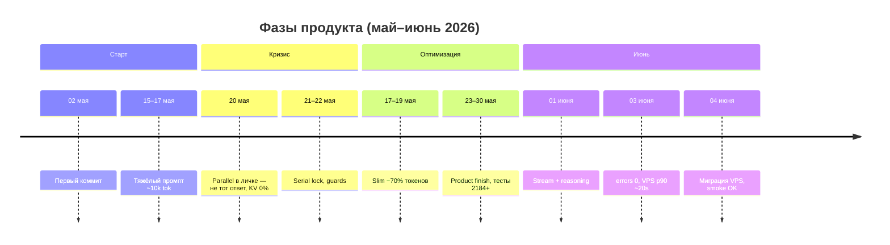
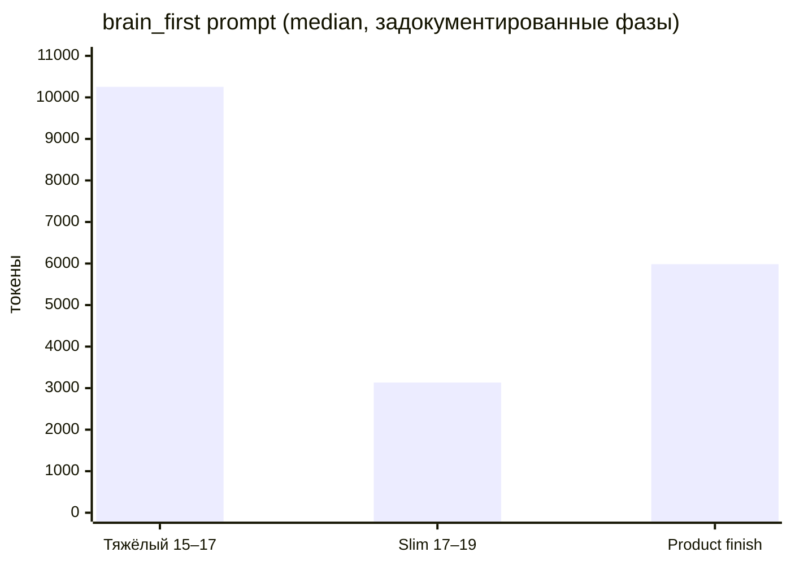
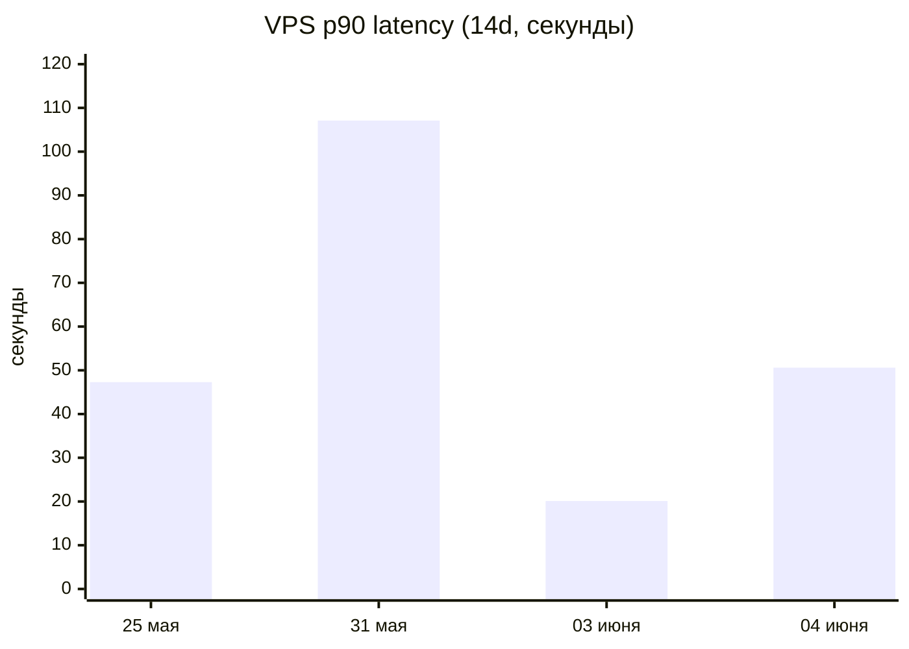

# Отчёт о продакшене — май–июнь 2026

> **Только ссылка:** ops-метрики **Telegram + OpenRouter** (3–8 users) — не compliance audit и не doc framework. Контекст: [CHATGPT_PASTE.ru.md](../CHATGPT_PASTE.ru.md)

**Период:** 2026-05-02 (первый коммит) → 2026-06-05  
**Снимок:** 2026-06-05  
**Для кого:** ревьюеры, которые спрашивают *«тесты, расходы, скорость — правда или README?»*

Презентационная сводка **измеренных** данных с приватного Telegram-бота (3–8 пользователей). Цифры взяты из ops-доков, `llm_usage.jsonl`, `turns.jsonl` и скриптов ниже — **не выдуманы**. Публичный `gemma_agent` — экспорт того же кода; здесь — что снято на проде и что можно проверить в git.

**English:** [PRODUCTION_EVIDENCE_REPORT.md](PRODUCTION_EVIDENCE_REPORT.md)

---

## 0. Зачем этот отчёт

**Для кого бот:** Telegram-ассистент на **3–8 доверенных пользователей** (семья / близкий круг) — не публичный SaaS и не enterprise.

**Что хотим доказать:**

| Да | Нет |
|----|-----|
| Тесты и CI реальны (проверяются в git) | «Самый умный агент на GitHub» |
| Токены, latency и $ **сняты с прода** | Независимый сторонний аудит |
| Проблемы были, фиксили, даты есть | Мгновенный чат и ноль багов в TG |
| Метод: **боль → метрика → фикс → новый снимок** | Маркетинг или разовый PDF «для красоты» |

**Кто автор:** владелец/оператор по логам прода — **инструмент рефлексии**, выложенный открыто, чтобы не верить только бейджам README. Сырые `turns.jsonl` / `llm_usage.jsonl` на сервере (приватность); в репо — агрегаты и скрипты.

**Для этого масштаба достаточно:** jsonl + еженедельные скрипты + честные оговорки. **Не заявляем:** observability уровня Datadog, SLO/SLA, устойчивую статистику на тысячах пользователей.

**Публичный GitHub:** **2026-06-06** — первый коммит в публичном репо. Прод и метрики в отчёте с **2026-05-02**. Не путать «дату создания на GitHub» с «проект вчера родился».

### Проверить vs доверять (внешние ревьюеры)

| Можно проверить без SSH на прод | Доверие оператору (или не оценивать прод) |
|---------------------------------|-------------------------------------------|
| 2580+ pytest, CI, `release_guard` в git | Строки в приватных `turns.jsonl` |
| Скрипты из отчёта есть в репо | Точные €/мес на VPS |
| §10 (median ≠ UX, CI ≠ TG) | Независимый security audit |

**Prod-цифры не аудируются из git** — в репо агрегаты и методология, не сырые PII-логи.

---

## 1. Вердикт за 30 секунд

| Вопрос | Ответ | Доказательство |
|--------|--------|----------------|
| Тесты есть? | **Да — 2580+** в публичном репо, CI на каждый PR | [`tests/`](../tests/), [CI.md](CI.md) |
| Прод стабилен? | **Да** — 0 runtime errors (14d, 03–04 июня) | DAILY_OPS (приватные ops) |
| Токены уменьшили? | **Да — −70%** median `brain_first` | METRICS_PERIODS |
| Скорость? | **Частично** — VPS p90 **107s → ~20s**; p50 чата **~13–15s** | METRICS_FULL §4 |
| Сколько стоит? | **~€2–5/мес VPS** + **~$0.0003 median за LLM-вызов** | SYSTEM_REQUIREMENTS, `llm_usage` |
| Зелёный pytest = идеальный TG? | **Нет** — разрыв задокументирован | [testing.md](developer-guide/testing.md) |

**Итог:** не демо без тестов и не счёт на тысячи долларов в день — **месяц измерений** на семейном боте.

---

## 2. Путь: откуда шагали → куда пришли



### Главные дельты

| Метрика | Было (май) | Стало (июнь) | Изменение |
|---------|------------|--------------|-----------|
| `brain_first` prompt median | **10 255** tok | **3 134** tok | **−69,4%** |
| KV hit 7d | **0%** (20.05) | **75–85%** | **+75 п.п.** |
| VPS p90 ходов 14d | **107,1 s** | **20,1 s** | **−81%** |
| Ошибки runtime 14d | **56+16** | **0+0** | **→ 0** |
| pytest (приватный прод) | **2 184** | **2 714** | **+24,3%** |
| Публичный экспорт | — | **2 578+** | проверяется в git |

---

## 3. Токены и история «26k на один запрос»

### 3.1 Что записала телеметрия

| Фаза | Даты | median prompt `brain_first` |
|------|------|----------------------------|
| Тяжёлый промпт | 15–17 мая | **10 255** |
| Slim rollout | 17–19 мая | **3 134** |
| Product finish | 23–30 мая | **2 194–5 984** |
| KV стабилен | 31 мая+ | hit **75–85%** |



### 3.2 ~26 000 токенов — воспоминание владельца

Автор помнит **~26 000 токенов на один запрос** в период тяжёлого промпта. В таблице фаз median **10 255** — это **один тег** `brain_first`, не сумма всего хода.

**Почему оба числа могут быть правдой:**

- Один **ход в Telegram** = несколько LLM-вызовов (`router` + `brain_first` + narrative…) — сумма `total_tokens` может перевалить за 20k.
- Длинный paste + память до slim и до compactor.
- Сейчас в `config/token_efficiency.yml`: `hard_limit_tokens: 12000`, compactor 0.7.

**Честно:** ~26k = **пик по ощущениям/админке**; **10 255** = **задокументированный median**. Не выдаём пик за среднее.

---

## 4. Задержки

### VPS p90 ходов (окно 14d)

| Снимок | VPS p50 | VPS p90 | Ошибки 14d |
|--------|---------|---------|------------|
| 25 мая | 10,7 s | 47,3 s | 56 / 16 |
| 31 мая | 7,9 s | **107,1 s** | 8 / 1 |
| 03 июня | 13,7 s | **20,1 s** | **0 / 0** |
| 04 июня | 15,5 s | 50,6 s | **0 / 0** |



Median LLM-вызова OpenRouter: **~5–9 s**. Узкое место — цепочки (новости, spatial, batch), не CPU VPS.

---

## 5. Стабильность

| Критерий | Май | Июнь 03–04 | Тренд |
|----------|-----|------------|-------|
| errors 48h | десятки | **0** | ↑ |
| KV 7d | 0→75% | 75–82% | ↑ |
| pytest | ~2184 | 2714 | ↑ |
| release_guard | OK | OK | = |

Закрыто: parallel в личке (20.05), router 404 (28.05), RSS-шторм, #19 follow-up (01.06).

---

## 6. Тесты — что видно в публичном репо

```bash
python scripts/print_repo_stats.py
python -m pytest tests/ --collect-only -q
```

| Слой | Значение |
|------|----------|
| Кейсов | **2580+** |
| Файлов | **410** |
| CI | каждый push/PR |
| release_guard | **90** файлов anti-regression |
| Приватный снимок | **2714** (03.06) |

**pytest ≠ живой Telegram** — инцидент 20.05: CI зелёный, в личке ответ «не на тот вопрос». Фикс: serial lock.

Примеры: `test_product_behavior.py`, `test_pipeline_chat_lock.py`, `test_orchestrator_intent_routing.py`.

---

## 7. Расходы

### Сервер (фикс)

| | Значение |
|--|----------|
| VPS_PROD | 1 vCPU, 3.8 GB, RSS бота **~172 MB** |
| Тариф | **~€2–5/мес** |
| GPU | **нет** — OpenRouter |

### OpenRouter (переменные)

Снимок с VPS (~745 записей `llm_usage`):

| | |
|--|--|
| Сумма `cost` | **~$0.28** |
| Median за вызов | **~$0.0003** |
| Median токенов | **~1198** |

Семейный трафик — **копейки в день**, не доллары за сообщение. Тяжёлые image/spatial/reasoning дороже.

Админка: `/admin_llm_usage`. Сырые логи в публичный git **не кладём** (приватность).

---

## 8. Скрипты снятия метрик

| Скрипт | Что даёт |
|--------|----------|
| `metrics_period_report.py` | agent vs LLM по дням |
| `daily_server_digest.py` | DAILY_OPS |
| `analyze_kv_session_metrics.py` | KV hit |
| `llm_usage_store.py` | запись в `llm_usage.jsonl` |

Полный хаб (приватно): `METRICS_FULL_REPORT_RU.md`. Этот файл — **публичное зеркало без секретов**.

---

## 9. Чего не утверждаем

- «Мгновенный чат» — p50 **~13–15 s** на VPS.
- «26k на каждый запрос» — был пик; median был **~10k**, сейчас **~3k** после slim.
- «2580 тестов = 100% TG» — нет, нужны prod turns.
- «Локальная LLM на устройстве» — **OpenRouter**.

---

## 10. Границы метрик (как не перечитать цифры)

Числа здесь — **срезы поведения в окне времени**, не «вечные свойства» системы. Это **observability lite** (event log + скрипты агрегации), не enterprise-мониторинг.

### Один вопрос — одна метрика

| Метрика | На что отвечает | На что **не** отвечает |
|---------|-----------------|------------------------|
| **Median** токенов / LLM ms | Типичный `brain_first` или вызов API | Худший ход пользователя (tools, narrative, retry) |
| **p90** latency хода | Хвост UX — когда «тормозит» | Средняя скорость чата |
| **Окно 14d** | Недавняя стабильность прода | Долгосрочный SLA |
| **Тег** в `llm_usage` | Стоимость/latency одного LLM-вызова | Полная цена одного сообщения в TG |
| **Зелёный pytest** | Детерминированная логика | Живой concurrency, пустые ответы провайдера, тайминг TG |

### Известные ловушки (есть в наших данных)

| Ловушка | Пример у нас | Риск |
|---------|--------------|------|
| **Малая выборка** | p90 **20s** (03.06) vs **50s** (04.06, после миграции) | Принять шум за победу или регрессию |
| **Median скрывает хвост** | LLM median **~5–9s**, p90 хода до **107s** | «API быстрый», а юзер ждёт цепочку |
| **Тег ≠ ход** | median **10k** `brain_first` vs пик **~26k** на turn | Недооценка $/запрос |
| **Шум intent** | **~40%** `scenario` за 24h (admin/probe) | Средние latency/токены ≠ пользовательский трафик |
| **CI ≠ prod** | 20.05 parallel в личке при зелёном CI | Тесты как полная модель системы |

### Три проекции — не одна истина

Система логируется на разных слоях; они **связаны, но не взаимозаменяемы**:

```
turns.jsonl          → один видимый ход (latency, outcome)
llm_usage.jsonl      → каждый вызов OpenRouter (токены, cost, tag)
metrics_timeseries   → свёрнутые ряды (runtime)
pytest / CI          → детерминированные пути в коде
```

**Главное правило честности:** median ≠ UX · CI ≠ корректность в TG · tag ≠ полная стоимость хода · малая выборка ≠ стабильное распределение.

### Ложная стабильность (цифры зелёные, боль у юзера остаётся)

Снимок может выглядеть **здоровым в агрегатах**, пока поведение для людей всё ещё неровное:

| Кажется «стабильно» | Почему может обманывать |
|---------------------|-------------------------|
| **errors 14d = 0** | Мало ходов; сбой ушёл в другой слой (news timeout → resilience, не `runtime_errors`) |
| **Median токенов ↓** | Хвост (image, narrative, batch spatial) дорогой — в median не виден |
| **KV hit 75–85%** | Admin/probe ≠ семейная личка; hit разный по профилю |
| **p90 улучшился в одном окне** | Следующее окно после миграции/деплоя снова прыгает (20s → 50s у нас) |
| **«Тихая неделя»** | 3–8 users ≠ репрезентативная нагрузка |

**Антипаттерн:** один KPI позеленел → «система стабильна». **Лучше:** после каждого снимка три вопроса:

1. **Юзеру было больно?** (долго, не тот ответ, 👎 — `turns.jsonl`, Telegram)
2. **Деньги поползли?** (median ровный, а $/ход или токены на *turn* в хвосте — одних тегов мало)
3. **CI поймал бы последний баг?** (если нет → тест или prod-check, как после 20.05)

Если хоть один ответ «нет» или «не знаю» — снимок = **поведение в окне**, не доказательство устойчивых свойств.

Для 3–8 пользователей этот цикл **инженерно корректен**. Для enterprise нужны SLO, алерты и разделение user/system трафика — это вне рамок отчёта.

---

## 11. Быстрые ссылки

| Документ | Зачем |
|----------|-------|
| [CI.md](CI.md) | Те же проверки, что в GitHub Actions |
| [HONEST_POSITIONING.md](HONEST_POSITIONING.md) | Q&A для ревьюеров |
| [SYSTEM_REQUIREMENTS.md](SYSTEM_REQUIREMENTS.md) | Реальное железо |
| [CHATGPT_PASTE.ru.md](../CHATGPT_PASTE.ru.md) | Вставка для AI-ревью |
| [testing.md](developer-guide/testing.md) | Качество тестов vs количество |

---

*Обновлено: 2026-06-06 (§10 ложная стабильность) · Источники: METRICS_FULL_REPORT, METRICS_PERIODS, DAILY_OPS 25.05–04.06, pain register 31.05, VPS sample.*
