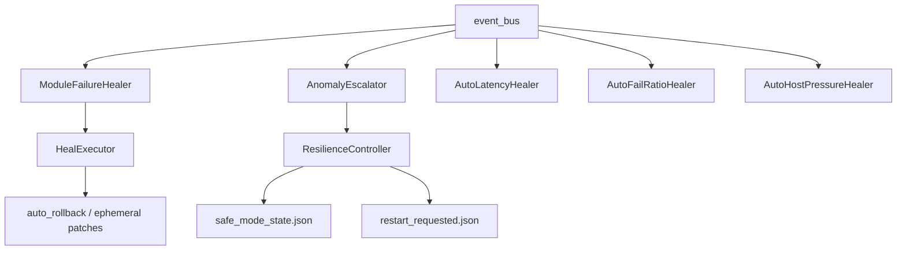

# Self-healing and resilience

Automatic degradation handling — **implemented**, not roadmap fiction.

---

## Components



| File | Role |
|------|------|
| `core/event_healers.py` | Async subscribers on event bus |
| `core/resilience_controller.py` | Safe mode, error thresholds, restart flag |
| `core/heal_executor.py` | Disable module, ephemeral LLM patches |
| `core/auto_rollback.py` | Development passport rollback |
| `core/brain/llm_transient_recovery.py` | Retry / model fallback on LLM errors |
| `core/connectivity_check.py` | External API reachability |

---

## Event healers (summary)

| Event | Healer | Action |
|-------|--------|--------|
| `module.failed` | ModuleFailureHealer | 3 fails → ephemeral patch; 5 → auto-disable |
| `anomaly.detected` | AnomalyEscalator | Escalate toward safe mode |
| `openrouter.done` | AutoLatencyHealer | P95 latency → threshold adjust |
| `openrouter.done` | AutoFailRatioHealer | High fail ratio → disable module |
| `maintenance.tick` | MaintenanceBridge | Periodic self-healing tick |
| `maintenance.tick` | AutoHostPressureHealer | CPU/RAM pressure → anomaly |

Env knobs: `HEALER_MODULE_MAX_FAILURES`, `HEALER_MODULE_AUTO_DISABLE_AT`, `HEALER_MODULE_RE_ENABLE_AFTER_SEC`

---

## Safe mode (ResilienceController)

When error totals or failed modules exceed thresholds:

1. **Enter safe mode** — only allowlist modules run (`SAFE_MODE_MODULE_ALLOWLIST`)
2. **Log + metrics** — `data/runtime_errors.jsonl`, `MONITOR` counters
3. **Recovery** — `RESILIENCE_RECOVERY_OK_CYCLES` stable cycles → exit safe mode
4. **Critical** — optional `restart_requested.json` for orchestrator restart

Default allowlist: `chat-orchestrator,math,echo,external_apis,memory`

```bash
pytest tests/test_resilience_controller.py tests/test_event_healers.py tests/test_auto_rollback.py -q
```

---

## LLM fallbacks

| Path | Trigger |
|------|---------|
| `llm_transient_recovery` | Timeout / 5xx from OpenRouter |
| `brain_glitch_fallback` | Empty or malformed model output |
| `fallback_direct_reply` | Pipeline failure → simple reply |
| `image_generator_fallback` | Image API failure |

Tests: `test_llm_transient_recovery.py`, `test_brain_glitch_fallback.py`, `test_fallback_direct_reply.py`

---

## Operator visibility

| Command / file | What |
|----------------|------|
| `/diag` | Snapshot for admins |
| `data/runtime/safe_mode_state.json` | Safe mode active? |
| `scripts/gemma_status.py --online` | Live health probe |

**Not guaranteed:** 99.9% SLA, zero-downtime multi-region. Designed for a **single VPS / home server** with honest ops.
